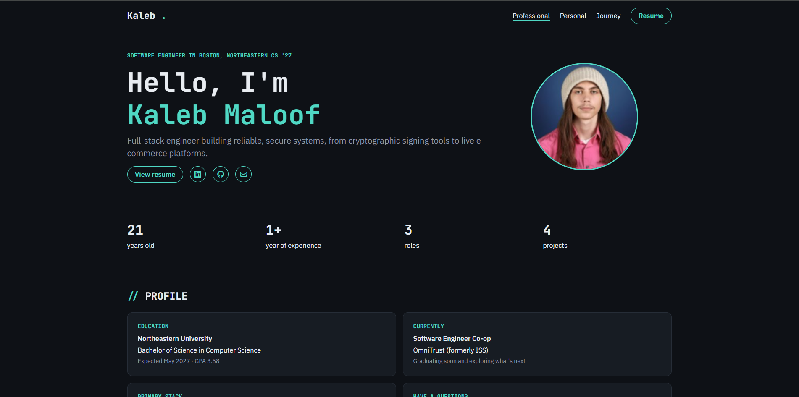

# Kaleb Maloof Personal Homepage

My personal homepage and portfolio, built as a static site with vanilla HTML, CSS, and JavaScript ES6 modules.

**Live site:** [maloofdev.github.io](https://maloofdev.github.io/)

## Author

**Kaleb Maloof**, Computer Science student at Northeastern University (expected May 2027)

- GitHub: [MaloofDev](https://github.com/MaloofDev)
- LinkedIn: [kalebmaloof](https://linkedin.com/in/kalebmaloof)

## Class Link

[Northeastern University course page](https://northeastern.instructure.com/courses/261032)

## Project Objective

Build a front-end-only personal homepage that introduces me as a software engineer and as a person. It needs to work on any static host, with no backend, no jQuery, no component libraries, and all JavaScript written as ES6 modules.

## Project Description

The site has three pages. Visitors can switch between them at any time with the links in the top navigation.

**Professional** (`index.html`) is for people evaluating me for a role:

- A hero with my role, resume link, social links, and stats calculated from data
- A profile panel with education, primary tech stack, current role, and a copy-email button
- Experience and project cards rendered from data modules

**Personal** (`personal.html`) is about who I am outside of work:

- A short greeting
- A hobbies grid, category cards, and widgets for my daily routine, goals, GIF wall, favorite song, and life stats

**Journey** (`journey.html`) shows how my school, jobs, and projects overlap:

- An interactive git commit graph where each job is a branch and each project is a commit, with tooltips on hover or focus
- Clicking a commit scrolls to its experience or project card and highlights it
- The graph is built as SVG from `js/data/journey.js` and switches to a vertical layout on small screens

Experience, projects, the journey graph, hobbies, and the life widgets are rendered from data modules in `js/data/`, so adding one only takes editing one file. The design document is in [docs/DESIGN.md](docs/DESIGN.md).

**Built with:** HTML5, CSS3, the Bootstrap 5 grid (CSS only), Bootstrap Icons, and vanilla JavaScript ES6 modules.

## Screenshot



## Instructions to Build

You need [Node.js](https://nodejs.org/) 18 or later.

1. Clone the repository and install the dev tools:

   ```bash
   git clone https://github.com/MaloofDev/MaloofDev.github.io.git
   cd MaloofDev.github.io
   npm install
   ```

2. Start a local server. It opens the site in your browser:

   ```bash
   npm start
   ```

   The site uses ES6 modules, which browsers won't load from `file://`. Open it through the local server rather than double-clicking `index.html`.

3. Optional checks:

   ```bash
   npm run lint          # ESLint
   npm run format:check  # Prettier check
   npm run format        # Prettier auto-format
   ```

There is no build step. To deploy, push to `main` and enable GitHub Pages for the repository root.

## License

[MIT](LICENSE) © 2026 Kaleb Maloof

## AI Assistance

AI was used on parts of this project:

- Helped generate this README
- Generated a well-structured boilerplate `package.json` with ESLint and Prettier configurations
- Created the Journey page from my prompts
- Assisted with the color scheme
- Processed images to reduce their file size
- Created illustration images for the NBA Elo Engine and Sports Data Scraper projects, which had no screenshots
- Created the site favicon

**Model Used:** Claude Opus 5.5 (via Claude Code)
