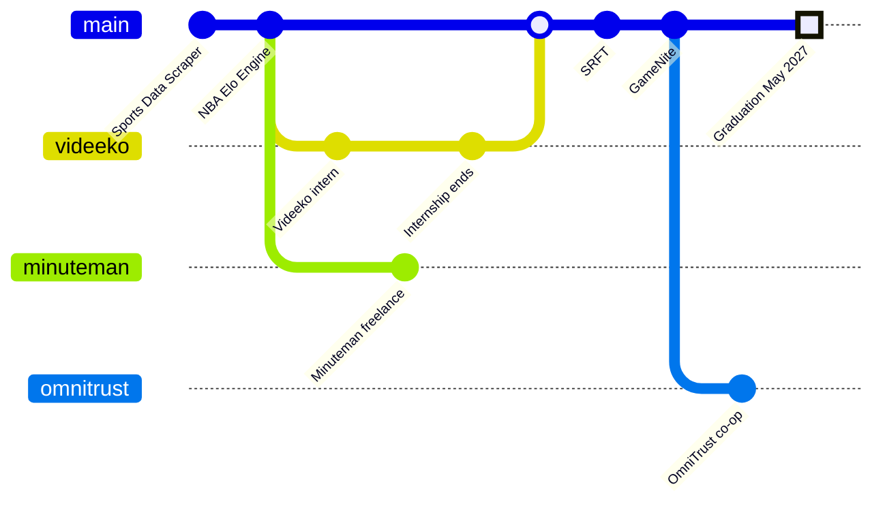

# Design Document: Kaleb Maloof Personal Homepage

## Table of Contents

1. [Project Description](#project-description)
2. [User Personas](#user-personas)
3. [User Stories](#user-stories)
4. [Design Mockups](#design-mockups)

---

## Project Description

This project is my personal homepage and portfolio. It introduces me as a software engineer and as a person. The site is front-end only and fully static, built with HTML5, CSS3, Bootstrap for layout, and vanilla JavaScript written entirely as ES6 modules. There is no backend and no jQuery, so the site can be hosted on any static host, such as GitHub Pages.

The site has three pages, and visitors can switch between them at any time using the links in the top navigation.

**Professional** is for people evaluating me for a role. It includes:

- A hero section with my name, role, resume link, social links, and a row of quick stats.
- A profile panel combining my education, current role, primary tech stack, and a "Have a question?" card that copies my email.
- An experience section with a card for each role, including what I built and the tools I used.
- A projects section with a card for each project, including its stack and a link to the GitHub repository.
- A footer with my name and profile links.

**Personal** is for anyone who wants to know who I am outside of work. It includes:

- A hero section with a friendly greeting.
- A hobbies section with a short description and photo for each hobby.
- A "components of my life" section with photo cards and small widgets: daily routine, goals, life stats, GIF wall, and favorite song.
- A thank-you section and the shared footer.

**Journey** shows how school, jobs, and projects overlapped. It includes:

- An interactive git commit graph. Each job is a branch and each project is a commit, and hovering or focusing a commit shows its title, dates, and a one-line summary.
- Experience and project cards below the graph. Clicking a commit scrolls to its card and highlights it.

### Creative Addition

The journey commit graph is the site's signature feature. My experience includes overlapping roles, which a resume flattens into a list. A branching graph shows that overlap honestly, and it also reflects how I work: managing merges across concurrent release branches is part of my current co-op.

---

## User Personas

### Kaleb Maloof: Site Owner

A Northeastern CS student graduating in May 2027, currently on co-op and applying for full-time roles.

- **Goals:** Show work that a one-page resume can't capture, and keep the site current with little effort.
- **Frustrations:** Resume bullets hide how projects and jobs overlapped, and editing raw HTML for every update is tedious.

### Maya Chen: Technical Recruiter

Screens dozens of new-grad candidates each week, often on her phone, and spends under a minute on a first pass.

- **Goals:** Quickly confirm graduation date, location, core languages, and relevant experience, then grab the resume and contact info.
- **Frustrations:** Portfolios that hide the basics or don't work well on mobile.

### Daniel Okafor: Engineering Manager

Reviews shortlisted candidates on a desktop before interviews and usually opens their GitHub.

- **Goals:** Judge real-world depth, including production systems, distributed services, testing, and teamwork.
- **Frustrations:** Vague bullets with no stack details, and projects with no code links or no sense of the candidate's role.

### Priya Raman: Fellow Developer

A classmate, teammate, or peer who finds the site through class or GitHub and browses out of curiosity.

- **Goals:** See what Kaleb has built, find shared interests, and get ideas for her own portfolio.
- **Frustrations:** Portfolios that feel like generic templates with no personality.

---

## User Stories

### Professional Page

**US-01: First impression**
*As a recruiter, I want to see who Kaleb is and when he graduates as soon as the page loads, so that I can decide in seconds whether to keep reading.*

Maya opens the link from an application on her phone. Without scrolling, she sees Kaleb's name, that he's a software engineer in Boston, that he graduates from Northeastern in 2027, and quick stats on his experience. She taps "View resume" and the PDF opens in a new tab.

**US-02: Education and stack at a glance**
*As a hiring manager, I want to see Kaleb's education and primary tech stack in one place, so that I can judge fit before reading the details.*

Daniel's team works in TypeScript and PostgreSQL. Just below the hero, the profile panel lists Kaleb's degree and graduation date alongside his main languages, frameworks, and infrastructure. Daniel spots both technologies immediately.

**US-03: Quick contact**
*As a recruiter, I want to copy Kaleb's email with one click, so that I can reach out without retyping it.*

Maya has a question about Kaleb's start date. She clicks "Copy email" in the "Have a question?" card, sees a short "Email copied" confirmation, and pastes the address into her email client.

**US-04: Experience details**
*As a hiring manager, I want each role to show what Kaleb built and with which tools, so that I can assess his engineering depth.*

On the OmniTrust card, Daniel reads about the cryptographic platform features Kaleb shipped and sees the stack he used, including RabbitMQ and PostgreSQL.

**US-05: Projects and code**
*As a developer or hiring manager, I want to see Kaleb's projects with their stack and a link to the code, so that I can review how he writes software.*

Priya remembers Kaleb's networking project from class. She finds the Secure Reliable File Transfer card, sees the stack and that it was a three-person team, and clicks through to the GitHub repository.

### Both Pages

**US-06: Switching pages**
*As any visitor, I want to switch between the Professional and Personal pages easily, so that I can explore both sides of Kaleb.*

After reading about Kaleb's projects, Priya wonders what he does outside of code. She taps "Personal" in the top navigation and lands on the Personal page.

**US-07: Footer links**
*As a visitor who has reached the end of a page, I want Kaleb's profile links in the footer, so that I can connect with him wherever I prefer.*

Daniel finishes reading and uses the footer's LinkedIn link to view Kaleb's profile.

**US-08: Accessibility**
*As a visitor using a keyboard or screen reader, I want every interactive element to be reachable and labeled, so that I can use the whole site.*

A visitor tabs through the site and can reach every link, button, and graph commit, with a visible focus outline on each.

### Personal Page

**US-09: Friendly introduction**
*As a fellow developer, I want a friendly introduction on the Personal page, so that I get a sense of Kaleb's personality right away.*

Priya is greeted with "Hello again? I'm Kaleb" at the top of the page.

**US-10: Hobbies**
*As a fellow developer, I want to read about Kaleb's hobbies, so that I can find things we have in common.*

Priya reads through the hobbies, each with a short paragraph and a photo, and finds one they share.

**US-11: Life widgets**
*As a curious visitor, I want small, glanceable widgets about Kaleb's life, so that I can learn fun details without reading long paragraphs.*

Priya scrolls past a daily routine, a goals list, life stats, a GIF wall, and a favorite song.

**US-12: Clear ending**
*As a visitor finishing the Personal page, I want a clear ending, so that I know I've seen everything.*

Priya reaches a "Thanks for visiting" message, then uses the top navigation to go back to the Professional page.

### Journey Page

**US-13: Journey timeline**
*As a hiring manager, I want to see Kaleb's journey as a timeline that shows overlapping roles, so that I understand how he balanced school, jobs, and projects.*

Daniel opens the Journey page and sees two job branches running side by side in the commit graph, so he understands that the internship and freelance work overlapped. He hovers the OmniTrust commit to read a one-line summary.

**US-14: Jump to details**
*As a hiring manager, I want to click a point on the timeline and see the full details, so that I can dig into the roles that interest me.*

Daniel clicks the OmniTrust commit, and the page scrolls to the OmniTrust experience card, which briefly highlights.

### Site Owner

**US-15: Easy updates**
*As the site owner, I want to add a job or project by editing a data file, so that keeping the site current takes minutes.*

Kaleb finishes a new project, adds one entry to the projects data module and one commit to the journey data, and pushes. The new card and graph commit appear without any HTML changes.

**US-16: Static hosting**
*As the site owner, I want the site to deploy as plain static files, so that I can host it for free without maintaining a server.*

Kaleb enables GitHub Pages on the repository, and the site works immediately.

---

## Design Mockups

These are low-fidelity wireframes showing layout and content placement, not final visuals.

### Professional Page (Desktop)

```
+------------------------------------------------------------------+
| Kaleb .                  [Professional] Personal Journey [Resume]|
+------------------------------------------------------------------+
|                                                                  |
|  Software engineer in Boston, Northeastern CS '27                |
|  Hello, I'm                                  Photo               |
|  KALEB MALOOF                                                    |
|  Short summary line                                              |
|  [View resume]  (in) (gh) (@)                                    |
|                                                                  |
|  21 years old     1+ yr experience     3 roles     4 projects    |
+------------------------------------------------------------------+
|  PROFILE                                                         |
|  +----------------------------+  +----------------------------+  |
|  | Education                  |  | Currently                  |  |
|  +----------------------------+  +----------------------------+  |
|  | Primary stack  [TS][React] |  | Have a question?           |  |
|  | Also: C/C++, Java, ...     |  | [Copy email]               |  |
|  +----------------------------+  +----------------------------+  |
+------------------------------------------------------------------+
|  EXPERIENCE                                                      |
|  +----------------+  +----------------+  +----------------+      |
|  | Logo           |  | Logo           |  | Logo           |      |
|  | OmniTrust      |  | Videeko        |  | Minuteman      |      |
|  | bullets, tools |  | bullets, tools |  | bullets, tools |      |
|  |                |  |                |  | Visit site     |      |
|  +----------------+  +----------------+  +----------------+      |
+------------------------------------------------------------------+
|  PROJECTS                                                        |
|  +---------------------------+  +---------------------------+    |
|  | Screenshot                |  | Screenshot                |    |
|  | Secure Reliable File      |  | GameNite                  |    |
|  | Transfer   [stack]        |  | [stack]                   |    |
|  | View on GitHub            |  | View on GitHub            |    |
|  +---------------------------+  +---------------------------+    |
|  | NBA Elo Engine            |  | Sports Data Scraper       |    |
|  +---------------------------+  +---------------------------+    |
+------------------------------------------------------------------+
|  Kaleb Maloof                                 (in) (gh) (@)      |
+------------------------------------------------------------------+
```

### Personal Page (Desktop)

```
+------------------------------------------------------------------+
| Kaleb .                  Professional [Personal] Journey [Resume]|
+------------------------------------------------------------------+
|                                                                  |
|                           Hello again?                           |
|                            I'M KALEB                             |
|                                                                  |
+------------------------------------------------------------------+
|  HOBBIES                                                         |
|  +----------------------------+  +----------------------------+  |
|  | Photo                      |  | Photo                      |  |
|  | Gaming                     |  | Music & Guitar             |  |
|  | short description          |  | short description          |  |
|  +----------------------------+  +----------------------------+  |
|  | Photo                      |  | Photo                      |  |
|  | 2000s nostalgia            |  | Ghost and Deimos           |  |
|  | short description          |  | short description          |  |
|  +----------------------------+  +----------------------------+  |
+------------------------------------------------------------------+
|  COMPONENTS OF MY LIFE                                           |
|  Photo cards: Gaming | Music | Computer, IT | Pets               |
|                                                                  |
|  +------------------+  +------------------+  +------------------+|
|  | Daily routine    |  | Goals            |  | Life stats       ||
|  | 4:30 wake up     |  | Undergrad        |  | 25 concerts      ||
|  | 6:30 work ...    |  | Start a band ... |  | 19,800 CS2 Elo   ||
|  +------------------+  +------------------+  +------------------+|
|  +----------------------------+  +----------------------------+  |
|  | GIF wall                   |  | Favorite song              |  |
|  | Six GIFs in a grid         |  | Spotify embed              |  |
|  +----------------------------+  +----------------------------+  |
+------------------------------------------------------------------+
|                    THANKS FOR VISITING                           |
+------------------------------------------------------------------+
|  Kaleb Maloof                                 (in) (gh) (@)      |
+------------------------------------------------------------------+
```

### Journey Page (Desktop)

Clicking a commit scrolls to its card below the graph. The Graduation commit shows a tooltip only.

```
+------------------------------------------------------------------+
| Kaleb .                  Professional Personal [Journey] [Resume]|
+------------------------------------------------------------------+
|                                                                  |
|  MY JOURNEY                                                      |
|  Each job is a branch and each project is a commit.              |
|                                                                  |
|  +------------------------------------------------------------+  |
|  | o--//--o----+-----------+----o----o---+-------o- - - - o   |  |
|  |             \           /              \                   |  |
|  |              o---------o  (internship)  o-----> (co-op)    |  |
|  |                 \                                          |  |
|  |                  o-------------------------> (freelance)   |  |
|  |                                                            |  |
|  | Legend: Education and projects | Videeko | Minuteman       |  |
|  |         OmniTrust                                          |  |
|  +------------------------------------------------------------+  |
+------------------------------------------------------------------+
|  EXPERIENCE   [OmniTrust]  [Videeko]  [Minuteman]                |
+------------------------------------------------------------------+
|  PROJECTS     [SRFT]  [GameNite]  [NBA Elo]  [Scraper]           |
+------------------------------------------------------------------+
|  Kaleb Maloof                                 (in) (gh) (@)      |
+------------------------------------------------------------------+
```

### Journey Commit Graph

The journey graph shows education and projects on the main line, with each job as its own branch.



### Mobile Layout

On small screens, every section collapses to a single column, the hero photo moves above the headline, and the navigation links wrap below the name. On the Journey page, the graph turns vertical, with time running downward.

```
+--------------------------------+
| Kaleb .                        |
| Prof Personal Journey [Resume] |
+--------------------------------+
|  Photo                         |
|  Hello, I'm                    |
|  KALEB MALOOF                  |
|  [View resume]                 |
|  21 yrs old  1+ yr exp         |
|  3 roles   4 projects          |
+--------------------------------+
|  [Education]                   |
|  [Currently]                   |
|  [Stack]                       |
|  [Copy email]                  |
+--------------------------------+
|  [OmniTrust]                   |
|  [Videeko]                     |
|  [Minuteman]                   |
+--------------------------------+
|  [SRFT]                        |
|  [GameNite]  ...               |
+--------------------------------+
```
